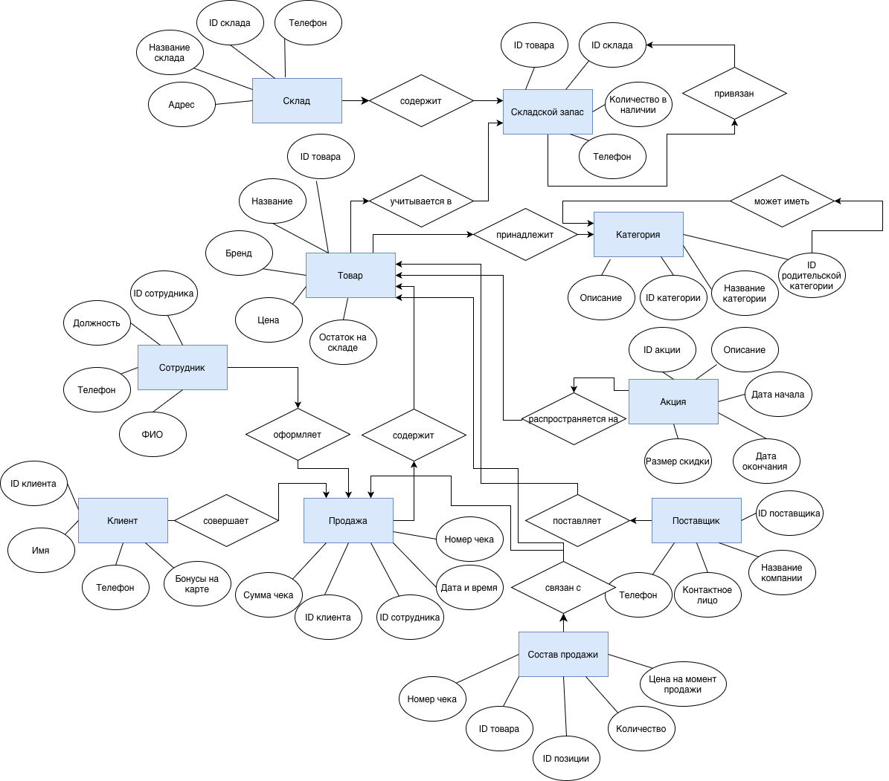
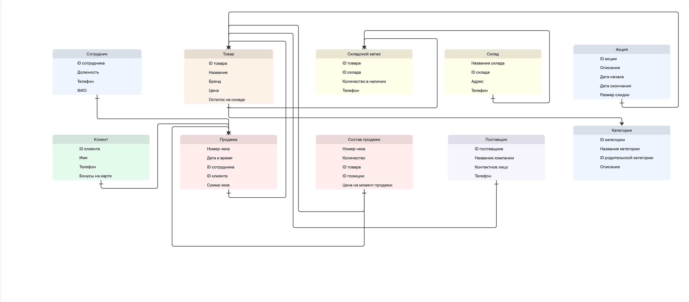

# sport-shop-database
База данных «Магазин спортивных товаров»

Курсовая работа по проектированию и реализации базы данных магазина спортивных товаров.

Концептуальная модель

Реляционная схема

СУБД

В качестве системы управления базами данных используется PostgreSQL.

Для администрирования и работы с базой данных используется pgAdmin 4.
